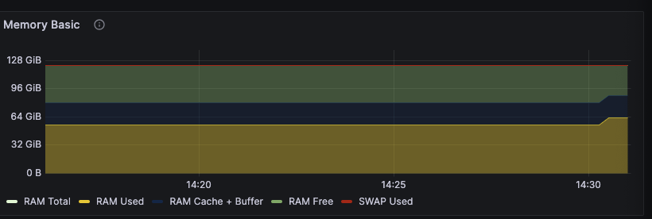

Problem `unicode1`:

1. it returns the NULL character
2. `__repr__` returns chars string representation which is unambiguous for debugging purpose, whilst `__str__` returns
   human-readable format which can be ambiguous sometimes.
3. it prints out empty for the first line, for second print it shows `this is a teststring` because NULL is not a space
   character.

Problem `unicode2`:

1. UTF-16 and UTF-32 has longer encoded bytes compared to UTF-8 encoding for the same string.
2. multiple bytes can be decoded on one character, but the wrong solution decodes only one byte at a time
3. `b = bytes([255, 255])`

Problem `train_bpe_tinystories`:

1. It took 4 minutes (235 seconds) and around 8.3 Gi of RAM. The longest token is `b' accomplishment'`. Yes, it makes
   sense.



2. The merging step takes more time compared to the pretokenization step.

```shell
   Ordered by: cumulative time
   List reduced from 564 to 10 due to restriction <10>

   ncalls  tottime  percall  cumtime  percall filename:lineno(function)
      880    0.001    0.000  235.510    0.268 /home/hanfa/miniconda3/lib/python3.13/multiprocessing/process.py:224(exitcode)
        1    0.014    0.014  210.636  210.636 /home/hanfa/assignment1-basics/tests/adapters.py:590(run_train_bpe)
  150/146   82.271    0.548  171.491    1.175 {built-in method posix.read}
    38/34    0.000    0.000  171.486    5.044 /home/hanfa/miniconda3/lib/python3.13/multiprocessing/connection.py:390(_recv)
       54    0.000    0.000  171.438    3.175 /home/hanfa/miniconda3/lib/python3.13/multiprocessing/pool.py:500(_wait_for_updates)
        1    2.489    2.489  121.285  121.285 /home/hanfa/assignment1-basics/cs336_basics/pretokenization.py:7(run_train_bpe_with_pretokenization_dict)
      111    0.001    0.000   90.362    0.814 /home/hanfa/miniconda3/lib/python3.13/multiprocessing/connection.py:1134(wait)
        1    0.000    0.000   89.335   89.335 /home/hanfa/miniconda3/lib/python3.13/multiprocessing/pool.py:738(__exit__)
        1    0.000    0.000   89.335   89.335 /home/hanfa/miniconda3/lib/python3.13/multiprocessing/pool.py:654(terminate)
       17    0.062    0.004   89.329    5.255 /home/hanfa/miniconda3/lib/python3.13/multiprocessing/connection.py:246(recv)
```

Problem `train_bpe_expts_owt`:

1. The longest merge is `ÂÃÂÃÂÃÂÃÂÃÂÃÂÃÂÃÂÃÂÃÂÃÂÃÂÃÂÃÂÃÂ` with idx `25822`. Yes, it makes sense since owt contains more
   character.
2. The tokenizer trained using OWT has more longer merges, sometimes even an complete word due to larger vocabulary
   size.

Problem `tokenizer_experiments`:

1. Test code available at [./tests/custom/test_tokenizer_experiments.py](./tests/custom/test_tokenizer_experiments.py).
   They have similar compress ratio around 4 bytes / token.

```text
10K tokenizer:
[tiny stories] text length: 7123, bytes length: 7123, encoded ids num: 1759, compress rate: 4.049459920409324 bytes/token, tput: 1035169.5156785974 bytes/sec
[owt] text length: 68358, bytes length: 69812, encoded ids num: 21397, compress rate: 3.2627003785577418 bytes/token, tput: 812894.5638599705 bytes/sec

32K tokenizer:
[tiny stories] text length: 7123, bytes length: 7123, encoded ids num: 1804, compress rate: 3.9484478935698446 bytes/token, tput: 938966.2264127224 bytes/sec
[owt] text length: 68358, bytes length: 69812, encoded ids num: 15811, compress rate: 4.415406995129973 bytes/token, tput: 974849.9364044652 bytes/sec
```

2. If you ran 10k tokenizer on OWT, it will have lower compress ratio than the 32k tokenizer.
3. Throughput is around `1 MB/sec`. For 825GB, it will take around 9.7 days.
4. Token IDs are within the range of `uint16` (0 to 65535 inclusive) given the 32k vocab size.