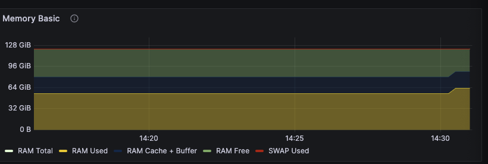
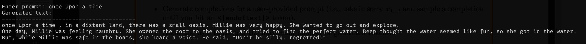

# Problem `unicode1`:

1. it returns the NULL character
2. `__repr__` returns chars string representation which is unambiguous for debugging purpose, whilst `__str__` returns
   human-readable format which can be ambiguous sometimes.
3. it prints out empty for the first line, for second print it shows `this is a teststring` because NULL is not a space
   character.

# Problem `unicode2`:

1. UTF-16 and UTF-32 has longer encoded bytes compared to UTF-8 encoding for the same string.
2. multiple bytes can be decoded on one character, but the wrong solution decodes only one byte at a time
3. `b = bytes([255, 255])`

# Problem `train_bpe_tinystories`:

1. It took 4 minutes (235 seconds) and around 8.3 Gi of RAM. The longest token is `b' accomplishment'`. Yes, it makes
   sense.



2. The merging step takes more time compared to the pretokenization step.

```shell
   Ordered by: cumulative time
   List reduced from 564 to 10 due to restriction <10>

   ncalls  tottime  percall  cumtime  percall filename:lineno(function)
      880    0.001    0.000  235.510    0.268 /home/hanfa/miniconda3/lib/python3.13/multiprocessing/process.py:224(exitcode)
        1    0.014    0.014  210.636  210.636 /home/hanfa/assignment1-basics/tests/adapters.py:590(run_train_bpe)
  150/146   82.271    0.548  171.491    1.175 {built-in method posix.read}
    38/34    0.000    0.000  171.486    5.044 /home/hanfa/miniconda3/lib/python3.13/multiprocessing/connection.py:390(_recv)
       54    0.000    0.000  171.438    3.175 /home/hanfa/miniconda3/lib/python3.13/multiprocessing/pool.py:500(_wait_for_updates)
        1    2.489    2.489  121.285  121.285 /home/hanfa/assignment1-basics/cs336_basics/pretokenization.py:7(run_train_bpe_with_pretokenization_dict)
      111    0.001    0.000   90.362    0.814 /home/hanfa/miniconda3/lib/python3.13/multiprocessing/connection.py:1134(wait)
        1    0.000    0.000   89.335   89.335 /home/hanfa/miniconda3/lib/python3.13/multiprocessing/pool.py:738(__exit__)
        1    0.000    0.000   89.335   89.335 /home/hanfa/miniconda3/lib/python3.13/multiprocessing/pool.py:654(terminate)
       17    0.062    0.004   89.329    5.255 /home/hanfa/miniconda3/lib/python3.13/multiprocessing/connection.py:246(recv)
```

# Problem `train_bpe_expts_owt`:

1. The longest merge is `ÂÃÂÃÂÃÂÃÂÃÂÃÂÃÂÃÂÃÂÃÂÃÂÃÂÃÂÃÂÃÂ` with idx `25822`. Yes, it makes sense since owt contains more
   character.
2. The tokenizer trained using OWT has more longer merges, sometimes even an complete word due to larger vocabulary
   size.

# Problem `tokenizer_experiments`:

1. Test code available at [./tests/custom/test_tokenizer_experiments.py](./tests/custom/test_tokenizer_experiments.py).
   They have similar compress ratio around 4 bytes / token.

```text
10K tokenizer:
[tiny stories] text length: 7123, bytes length: 7123, encoded ids num: 1759, compress rate: 4.049459920409324 bytes/token, tput: 1035169.5156785974 bytes/sec
[owt] text length: 68358, bytes length: 69812, encoded ids num: 21397, compress rate: 3.2627003785577418 bytes/token, tput: 812894.5638599705 bytes/sec

32K tokenizer:
[tiny stories] text length: 7123, bytes length: 7123, encoded ids num: 1804, compress rate: 3.9484478935698446 bytes/token, tput: 938966.2264127224 bytes/sec
[owt] text length: 68358, bytes length: 69812, encoded ids num: 15811, compress rate: 4.415406995129973 bytes/token, tput: 974849.9364044652 bytes/sec
```

2. If you ran 10k tokenizer on OWT, it will have lower compress ratio than the 32k tokenizer.
3. Throughput is around `1 MB/sec`. For 825GB, it will take around 9.7 days.
4. Token IDs are within the range of `uint16` (0 to 65535 inclusive) given the 32k vocab size.

# Problem `transformer_accounting`:

1. For every layer,

| Layer                                   | Params num    |
|-----------------------------------------|---------------|
| token_embedding.indexing                | 50257 *  1600 |
| transformer_blocks.{i}.block.0.weights  | 1600          |
| transformer_blocks.{i}.block.1.q_proj   | 1600 * 1600   |
| transformer_blocks.{i}.block.1.k_proj   | 1600 * 1600   |
| transformer_blocks.{i}.block.1.v_proj   | 1600 * 1600   |
| transformer_blocks.{i}.block.1.o_proj   | 1600 * 1600   |
| transformer_blocks.{i}.block2.0.weights | 1600          |
| transformer_blocks.{i}.block2.1.weight1 | 6400 * 1600   |
| transformer_blocks.{i}.block2.1.weight2 | 6400 * 1600   |
| transformer_blocks.{i}.block2.1.weight3 | 6400 * 1600   |
| norm.weights                            | 1600          |
| output_embedding.weights                | 50257 *  1600 |

Total parameter num is 2127057600, which translate to 2.12GBi assuming single precision.

2. For every layer,

| Layer                      | FLOPs                                                    |
|----------------------------|----------------------------------------------------------|
| token_embedding.indexing   | 2 * 1024 * 50257 * 1600                                  |
| transformer_blocks.{i}.ln  | no matmul                                                |
| transformer_blocks.{i}.mha | 3 * 1024 * 1600 * 1600 + 25 * (2 * 1024 * 1024 * 64 * 2) |
| transformer_blocks.{i}.ffn | 2 * 1024 * 1600 * 6400 * 3                               |
| output_embedding.weights   | 2 * 1024 * 50257 * 1600                                  |

Total FLOPs from matrix multiplications is around 4048873062400 aka 4TFLOPs.

3. FFN requires most FLOPs.
4. Both FFN and attention block takes increasing portion of FLOPs as model's hidden dimension scales, especially the
   MHA.
5. The total FLOPs will increase actually more than 16 times. MHA will take a larger portion of FLOPs since it scales
   quadratically as the max sequence length.

# Problem `learning_rate_tuning`:

See test `TestOptimizer.test_simple_training_with_sgd_optimizer`. The loss decays faster with larger learning rate. It
doesn't diverge because of the decay factor over time.

# Problem `adamwAccounting`:

(a) RMSNorm takes `d_model` parameters. MHA takes `4 * d_model * d_model` parameters.
Point-wise FFN takes `d_model * d_ff + d_ff + d_ff * d_model + d_model`. Output RMSNorm takes `d_model`.
Output embedding takes `d_model * vocab_size`. Hence, the total memory AdamW takes is

```text
# - First moment (momentum): 1 copy per parameter
# - Second moment (variance): 1 copy per parameter  
# - Parameters copy for updates: 1 copy per parameter (in fp32)
optimizer_state = 4 bytes * 3 * ( num_layers * (4 * d_model * d_model + d_model * d_ff + d_ff + d_ff * d_model + d_model) + d_model + d_model * vocab_size )
```

(b) `batch_size` contributes to the activation memory.

```text
activation_memory = 4 bytes * (batch_size * sequence_length * d_model * num_layers)
```

Hence we need `optimizer_state + activation_memory < 80GB`.

(c) AdamW requires 16 FLOPs to update one parameter in a step.

```text
AdamW algorithm per parameter:
1. g_t = ∇f(θ_{t-1})                    # Gradient (computed in backward pass)
2. m_t = β₁ * m_{t-1} + (1-β₁) * g_t    # First moment update (3 FLOPs)
3. v_t = β₂ * v_{t-1} + (1-β₂) * g_t²   # Second moment update (4 FLOPs)
4. m̂_t = m_t / (1 - β₁ᵗ)               # Bias correction (2 FLOPs)
5. v̂_t = v_t / (1 - β₂ᵗ)               # Bias correction (2 FLOPs)
6. θ_t = θ_{t-1} - α * (m̂_t / (√v̂_t + ε) + λ * θ_{t-1})  # Parameter update (5-6 FLOPs)
```

Hence,

```text
flops_per_step = 16 * optimizer_state
```

(d) Training GPT-2 XL for 400K steps would take approximately 13 days on a single A100 GPU.
GPT-2 XL with 1.5B parameters. Assuming `tokens_per_step = batch_size * seq_len=1024`. Observed tput is 9.8 TFLOP/s (50%
MFU as given).
Forward pass: 9.2 TFLOPs per step (6N rule: 6 × 1.5B × 1,024 tokens). Total per step: 27.6 TFLOPs (including 2× backward
pass overhead).
Hence time per step is 2.84 sec and tototal time is 13.1 days.

# Problem `train_together/learning_rate`

I've implemented the training loop logics at [./cs336_basics/entrypoint/train.py](./cs336_basics/entrypoint/train.py).

I trained an LM according to the PDF baseline, please see the [
`SampleConfig`](./cs336_basics/entrypoint/train_config.py) with
achieving validation loss around 1.6 (details
in [mlflow](https://mlflow.sutroplanet.com/#/experiments/129/runs/5556912c70c84ecdba65868515fa905a)).

Sweep w. different
LRs [mlflow](https://mlflow.sutroplanet.com/#/compare-runs?runs=[%22c5ff3b9b6a71423585bfe03e24e6a5da%22,%2286d7a7f3b39c4b8ca0cb9cb3ad9ff80c%22,%22eee8b94b0f3f4dc0af95c26b0d3bfab9%22,%22ad18da63ee184941ace4aa549b6c40c2%22,%222f23bdbedce34f718a3641bad1755886%22,%22cb776da7b9944643aa576f0328c60627%22,%2292817e37789b4cbe9d3d5304baf05120%22]&experiments=[%22129%22])
and it shows the best constant LR for AdamW is around 1e-3. Using this setup ultimately gave us nats CE loss around
1.45 after more training,
see [mlflow run](https://mlflow.sutroplanet.com/#/experiments/130/runs/8f6cec5c9c624922baf950062dfcbca1).

# Problem `decoding`

An interactive, decoding script that allows top-k/top-p sampling has been implemented
at [./cs336_basics/entrypoint/inference.py](./cs336_basics/entrypoint/inference.py).

Example conversation looks like below.




